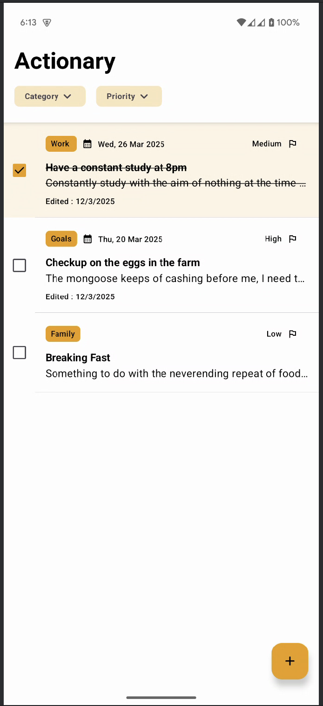
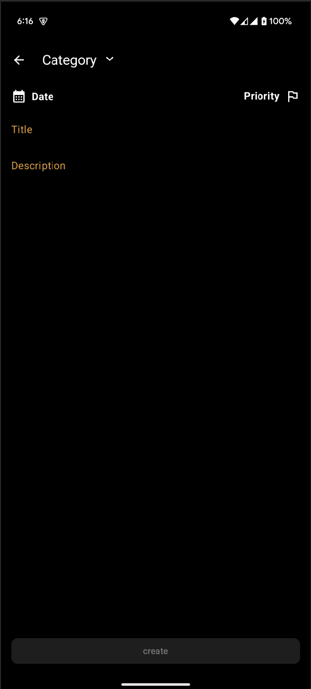

# Actionary

"Actionary" – Like a dictionary, but for actions! (digital factory take home assessment)

## Features

- [X] create, update and delete a task
- [X] display a list of tasks
- [X] display details of a task
- [X] mark tasks as completed
- [X] prioritize tasks
- [X] categorize tasks
- [X] set task due date

## Design

### Light

|                                          Tasks                                          |                                         Task                                          |                                         Edit                                          |                                          Create                                           |                                            Categories                                             |                                         Filtered                                          |
|:---------------------------------------------------------------------------------------:|:-------------------------------------------------------------------------------------:|:-------------------------------------------------------------------------------------:|:-----------------------------------------------------------------------------------------:|:-------------------------------------------------------------------------------------------------:|:-----------------------------------------------------------------------------------------:|
|  |  |  |  |  |  |

### Dark

|                                         Tasks                                          |                                         Task                                         |                                         Edit                                         |                                          Create                                          |                                            Categories                                            |                                         Filtered                                         |
|:--------------------------------------------------------------------------------------:|:------------------------------------------------------------------------------------:|:------------------------------------------------------------------------------------:|:----------------------------------------------------------------------------------------:|:------------------------------------------------------------------------------------------------:|:----------------------------------------------------------------------------------------:|
|  |  |  |  |  |  |

## Architecture

This project uses the MVI(Model - View - Intent) architecture based on UDF(Unidirectional Data Flow)
and Reactive programming.

### Packaging Structure

- `modules-datasources`
    - `local`
      - handles getting cached device data
- `modules-data`
  - `core`
    - handles getting and mutating data from needed sources
  - `domain`
    - handles encasing business logic for reuse
- `modules-ui`
  - `design`
    - handles defining key components that can be reused throughout the app
  - `presentation`
    - handles displaying data on device

### Testing

The app includes both unit and instrumented tests.
#### Sources
---

- DAO

|                                           TaskDAO                                            |
|:--------------------------------------------------------------------------------------------:|
|  |

- Source

|                                         TaskLocalSource                                         |
|:-----------------------------------------------------------------------------------------------:|
|  |

#### Data
---

- Repositories

|                                     TaskRepository                                      |
|:---------------------------------------------------------------------------------------:|
|  |

#### ui
---

- screen-model

|                                      TasksScreenModel                                       |
|:-------------------------------------------------------------------------------------------:|
|  |

- screen

|                                       TasksScreen                                       |
|:---------------------------------------------------------------------------------------:|
|  |

## Stack

### Language & Framework

| Title                                                    | Description                        |
|:---------------------------------------------------------|:-----------------------------------|
| [Kotlin](https://kotlinlang.org/)                        | `fun` programming language         |
| [Jetpack Compose](https://developer.android.com/compose) | declarative UI rendering framework |

### Libraries

| Title                                                                    | Description          |
|:-------------------------------------------------------------------------|:---------------------|
| [Kotlinx-DateTime](https://github.com/Kotlin/kotlinx-datetime)           | date/time library    |
| [Kotlinx-Coroutines](https://github.com/Kotlin/kotlinx.coroutines)       | async programming    |
| [Kotlinx-Serialization](https://github.com/Kotlin/kotlinx.serialization) | serialization        |
| [Voyager](https://github.com/adrielcafe/voyager)                         | navigation           |
| [Koin](https://github.com/InsertKoinIO/koin)                             | dependency injection |
| [Room](https://developer.android.com/training/data-storage/room)         | data persistence     |

## Improvements
### Layered
- [ ] Sources
    - [ ] add tests for CategoryDAO and LocalSource
- [ ] Data
    - [ ] add tests for CategoryRepository
    - [ ] remove unused functions and test unhappy paths
- [ ] UI
    - [ ] add tests for unhappy paths for TasksScreenModel
    - [ ] add tests for TaskScreen
    - [ ] add archiving a single task
    - [ ] add sorting and filtering by date
